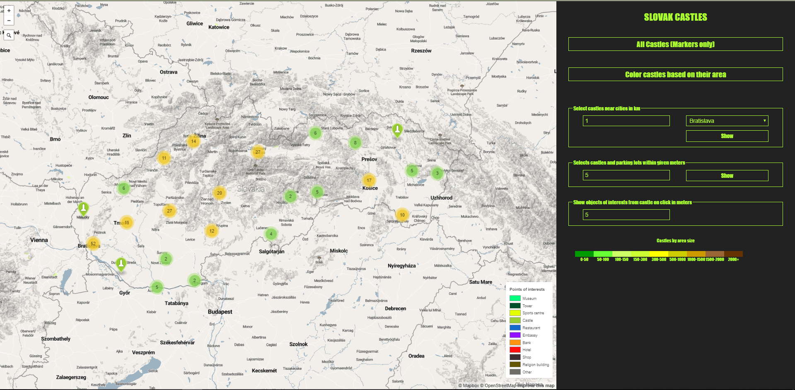

##### Ján Čegiň
##### PDT 2018/19 Assignment

## Overview

This application displays castles in Slovakia. The castles are displayed as either point marks
or polygons in which case their coloring depends upon their area size.

The application also shows point of interests (buildings only) with different coloring based as to what kind of
building it is upon clicking on the castle marker. It also shows all the castles with parking lots in the approximity
of each other. On keystroke of the selected caslte point the pedestrian road network is showed within 500 metres from the castle
with the lengths of each path displayed on click. 
 
Last but not least, the castles are filtered to be within x number of km from given major city in Slovakia.
 
Below is the screen of the application with clustering based of castle points.

### Project Structure

The magic happens in the files under `routes/` and `views/` directories. In the `routes` directory
the file `index.js` is located, where all the API endpoints are written as well as query builders used to 
interact with the database.

In the `views` three files are located. `index.jade` serves to extend the layout with adding
buttons, loading the map and adding the legends to it. `layout.jade` is the entry point where the
main javascript scripts are located to cluster, add events to points, etc.

### Map layout

The layout of the map was created from a basic theme using mapbox studio to edit it. 
Things that were changed include:

* change of water areas color
* leisure zone of parks was colored with subtle green to emphasize on the surroundings of castles
* change of font styles and sizes for names of cities
* added hillshade
* added mountain peak names
* change train station colors

### Database

The data were taken from [download.geofabrik.de](https://download.geofabrik.de/) for the latest version of Slovakia 
(website was accessed and data download on 5th November). 

To speed up specific queries I utilized indexes. For the `planet_osm_polygon` table the indexes 
are: 
* `index_polygons_on_historic_name`
* `index_polygons_on_building`
* `index_polygons_on_amenity`

For the `planet_osm_point` the indexes are:
* `index_points_on_historic_name`
* `index_points_on_place_population`

For the `planet_osm_line` the indexes are:
* `index_lines_on_highway`

### API and queries

#### GET `/castles` - return castles as point markers

This endpoint returns all the castles as point markers. First of all a UNION operation is used to 
get all the point and polygon castles (as if they are present in one table, they arent present in the other one).
Then a GROUP BY with name of the castle is used to `ST_Collect` given geometries, so we dont have
multiple points for each castle. 

Then, for the polygon/multipoint geometry a `ST_Centroid` is used to 
retrieve the centroid of given polygon/multipoints. This is done as join of the UNION and the multipoint/polygon subtable
to have given centroid for every distinct castle name.

#### GET `/castles-poly` - return castles with their area size

First of all, from the polygons using `ST_Area` an area size is calculated and GROUP BY name to 
ensure that we have a complete area size for the castle, even if it consists of multiple buildings.
Their geometries are preserved using `ST_Union` to create a multipolygon. 

The last thing is the UNION of the table on itself with the exception of the second one returning a centroid
to represent the castle as a pointer also. The coloring is then handled by the server.

#### GET `/closeParking?num=500` - return all castles with parking lots near them in meters
In this case we first get a set of points representing castles and then all the polygons which are parking lots. Then,
using a CROSS JOIN with a WHERE clause for the `ST_DWithin` using the supplied `num` parameter from the query we get all
the castles and parking lots. To get them both, the query is run twice to extract both the parking lots as well as the castles.

#### GET `/closeTowns?id=123&num=500` - return all castles which are x km away from the given city
Quite a simple query to return all castles within the proximity of given town in km using the `ST_Distance` and WHERE 
clause to check if its from the proximity of the town.

#### GET `/closeInterests?id=123&num=500` - return all PoI for the given castle within x meters
In this case points of castles are selected like in `castles` case and all polygons which represent buildings are returned.
They are then colored by the Server part of the application. `ST_DWithin` is used for distance measurement as we dont know
where the entrance to the building is.

#### GET `/roads?id=123` - return pedestrian road network in proximity of the castle
First the castle points are selected as shown above. Then, all lines are selected, which are of types 'footway', 'steps', 'pedestrian' or 'footpath'
only if they are atleast partially inside a circle created by the `ST_Buffer` function. However, to show not the entire way/road,
`ST_Intersection` is used to get only that part of the road, which is actually intersecting the circle/buffer.
Then the geometry is transformed and length of the line is also calculated using `ST_Length`. The length is then shown in the 
description of the road. The road network is then colored via server part of the application.

